# Analysis-on-LFB-Incident-Data-in-Havering-Borough

## Introduction
The purpose of this exploratory data analysis (EDA) is to gain insights into the data, identify any patterns or trends, and explore relationships between variables. This will help us to better understand the data and inform any further analysis or modeling that may be performed.
In this EDA, we will explore various aspects of the data, such as the frequency and types of incidents, response times, and costs associated with incidents. We will also examine the relationships between variables, such as the relationship between incident type and response time, to see if certain types of incidents tend to have faster or slower response times. Additionally, we will use heat maps and correlation matrices to explore the relationships between different variables. Finally, we will identify any outliers or anomalies in the data that may need further investigation.

The London Fire Brigade (LFB) is the statutory fire and rescue service for London. The brigade covers an area of 1582 square kilometers and a population of nearly 9 million people. The London Fire Brigade maintains a detailed record of all incidents it attends, including the date and time of the incident, the type of incident, the location, the duration of the incident, and other information. [1]
London Fire Brigade (LFB) data contains a wealth of information that can be used to perform both predictive modeling and descriptive modeling.
Predictive modeling involves creating a model that can predict an outcome based on input variables. In the case of LFB data, a predictive model could be used to predict the response time to a fire incident based on various input variables such as the time of day, location, and type of incident. Other predictive models could be used to predict the likelihood of false alarms, the cost of an incident, or the severity of the incident.[2]
Descriptive modeling, on the other hand, involves creating a model that describes relationships between variables in the data. In the case of LFB data, descriptive modeling could be used to identify patterns and relationships between variables, such as the relationship between the type of incident and the response time or the relationship between the location of the incident and the severity of the incident. Descriptive modeling can also be used to identify trends and patterns in the data that can inform decision-making processes.[3]
Both predictive and descriptive modeling can be used to extract insights from the LFB data and improve decision-making processes within the fire service. Predictive models can help the fire service allocate resources more effectively and respond to incidents more quickly, while descriptive models can help the fire service identify areas for improvement and develop new strategies for preventing and responding to incidents.

## Business Understanding
The London Fire Brigade (LFB) is the statutory fire and rescue service for London, covering an area of approximately 620 square miles and serving a population of over 8 million people. The LFB is the busiest fire and rescue service in the country and one of the largest firefighting and rescue organizations in the world. [1]
The LFB is responsible for providing fire and rescue services across the Greater London area, responding to a wide range of incidents including fires, road traffic accidents, hazardous materials incidents, and other emergencies. The service is also responsible for providing fire safety advice and education, as well as conducting fire safety inspections and enforcing fire safety regulations. [1]
To manage the large volume of data generated by its operations, the LFB collects and stores data on all incidents it responds to. This data includes information on the date and time of the incident, the type of incident, the location, the resources deployed, and the outcomes of the incident.
The LFB data has been widely used for various applications such as predictive modeling, incident prevention, and resource allocation. Predictive modeling is used to forecast the likelihood of future incidents based on historical data. Descriptive modeling, on the other hand, is used to gain insights into the patterns and relationships within the data to inform decision-making.
Objective
1*	Cost Analysis: Analyzing the costs associated with each incident would allow the London Fire Brigade to identify areas for cost savings and optimize their budget.

2*	Incident Prediction: Predicting the type and severity of incidents before they occur would allow the London Fire Brigade to better allocate resources and respond more effectively to incidents.

## Terminologies
-	IncidentNumber: A unique number assigned to each incident recorded by LFB.
-	DateOfCall: The date on which the incident was reported to LFB.
-	CalYear: The year in which the incident was reported.
-	TimeOfCall: The time at which the incident was reported.
-	HourOfCall: The hour at which the incident was reported.
-	IncidentGroup: A classification of the type of incident, such as fire, false alarm, or special service.
-	StopCodeDescription: A code indicating the nature of the incident, such as "Fire - Building" or "Special Service - Flooding".
-	PropertyCategory: A classification of the type of property involved in the incident, such as dwelling, commercial, or industrial.
-	PropertyType: A more detailed classification of the type of property involved, such as house, office, or warehouse.
-	Postcode_district: The first part of the postcode of the location where the incident occurred, which identifies the general area of London.
-	IncGeo_WardNameNew: The name of the electoral ward in which the incident occurred.
-	FRS: The name of the Fire and Rescue Service responsible for responding to the incident.
-	IncidentStationGround: The name of the LFB fire station that responded to the incident.
-	FirstPumpArriving_AttendanceTime: The time it took for the first fire engine to arrive on the scene after the incident was reported.
-	Notional Cost (£): An estimate of the cost of the incident to LFB.
-	NumCalls: The number of calls made to LFB about the incident.
-	MinutesOfCall: The duration of the incident from the time it was reported to LFB to the time the last fire engine left the scene.

## Data Understanding
#### Data Collection and Description Report
The London Fire Brigade (LFB) incident data was collected through LFB Open Data Portal: The LFB Open Data Portal provides access to a wide range of data related to fire incidents, including location, time, date, and type of incident. The data is available in a range of formats, including CSV, XML, and JSON, and can be downloaded for analysis.
- Quality Report
Data quality refers to the accuracy, completeness, consistency, and reliability of data. It is the degree to which data is fit for its intended purpose, and it plays a critical role in determining the usefulness of data for decision-making and analysis.
Data quality is an important aspect of any dataset. We performed an initial data quality check by examining missing values, data types, and ranges of numeric fields. The results of the data quality check are summarized below:

- Missing Values: We found missing values in multiple columns. We addressed the missing values in the "FirstPumpArriving_AttendanceTime”, “PumpCount”, “NumStationsWithPumpsAttending”, “Notional Cost (£)" column by replacing them with the mean, mode, & median values. For the other columns that has missing values more than 50% we dropped them. Below fig 1 shows the number of missing values in our datasets.

## Exploratory Analysis Report
*After addressing data quality issues, we performed data exploration to gain insights into the data. The results of the data exploration are summarised below:*

- Top 10 Wards in Havering by Incidents:
  We plotted the top 10 wards by incident in havering and found that St. Edward's has the highest number of fire incidents. Rainham & Wennington has the second highest number of incidents. The lowest number of incidents occurred in Marshalls & Rise Park.
  
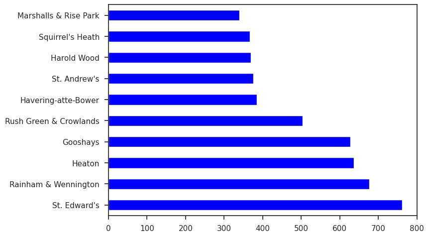

- Most Occurrence of incident type:
  We plotted the top 10 common type of incident in havering and found that False Alarm is the highest while Fire incident has the lowest number of incidents.
  
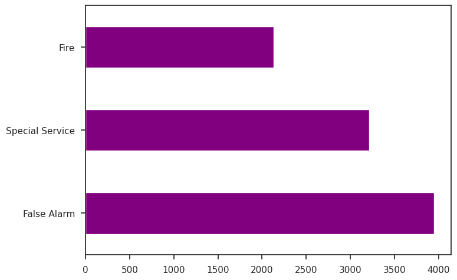

- Top 5 Property Affected by each type of incident
  The Figure below show bar plot distribution of each type of incident group and we can see that for Fire Incident, False Alarm and Special Service, highest affected property type is House- Single Occupancy however for Fire Incident the less damaged property is Car and the lowest number of False Alarm came from Old Person home.
  
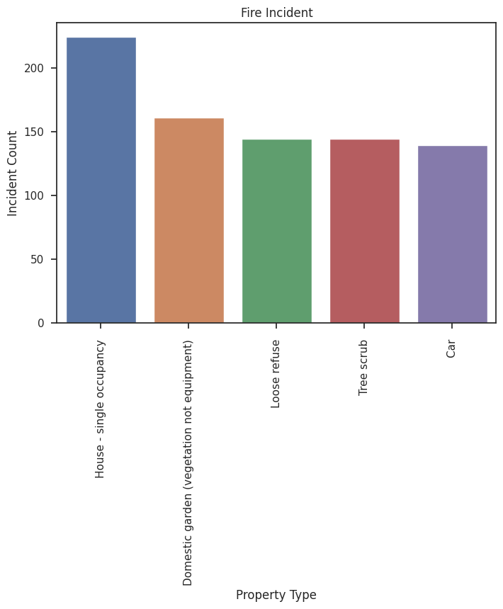
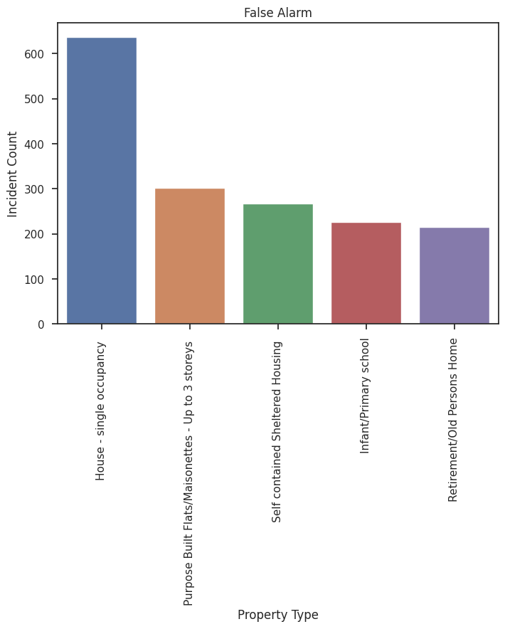
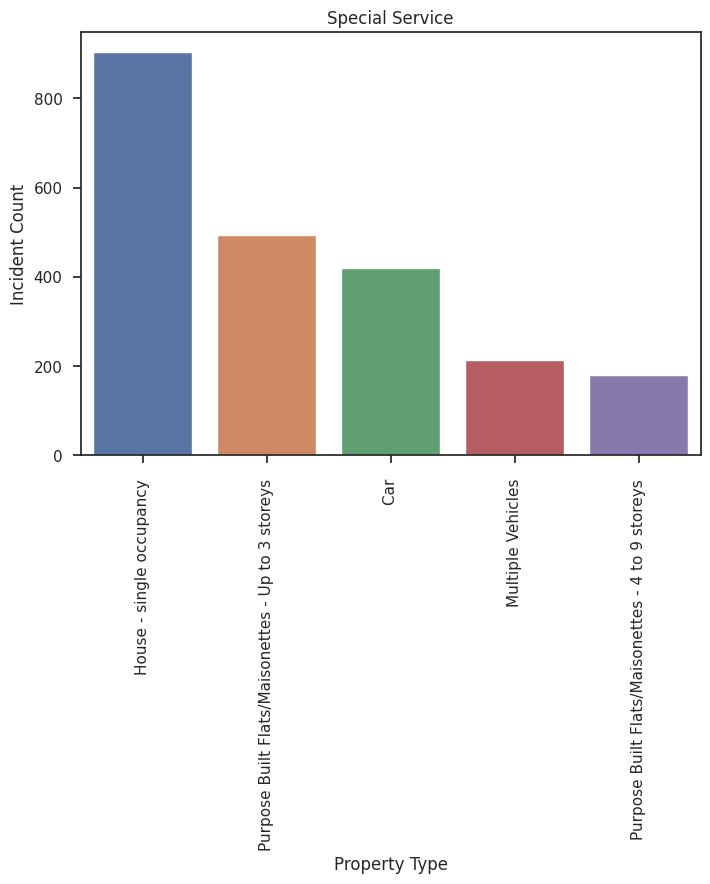

- Percentages of Property Category Affected by Each Incident Group
  Here we plot the percentages of each incident type by property category to visualize which category is most affected by each incident type and we found that Outdoor category is mostly affected by Fire and second being the Dwelling. As for False Alarm and Special Service Dwelling has the highest percentage. 38.8% of False Alarm came from Dwelling and more than half percent special service required for this property category.

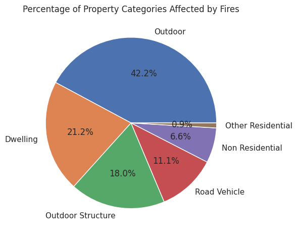
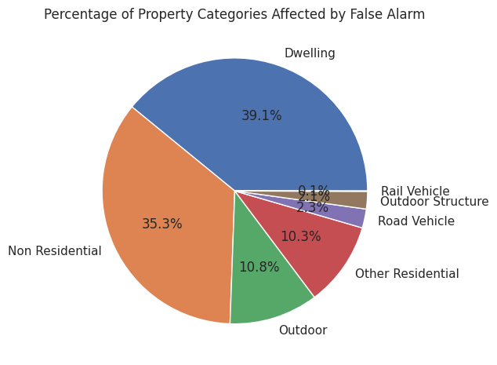
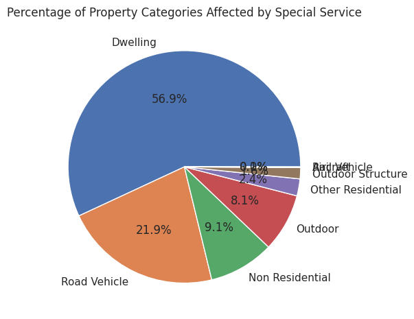

- Most Outdoor Property Affected by Fire
  From the bar plot below, we can see that domestic garden property was damaged most by fire.
  
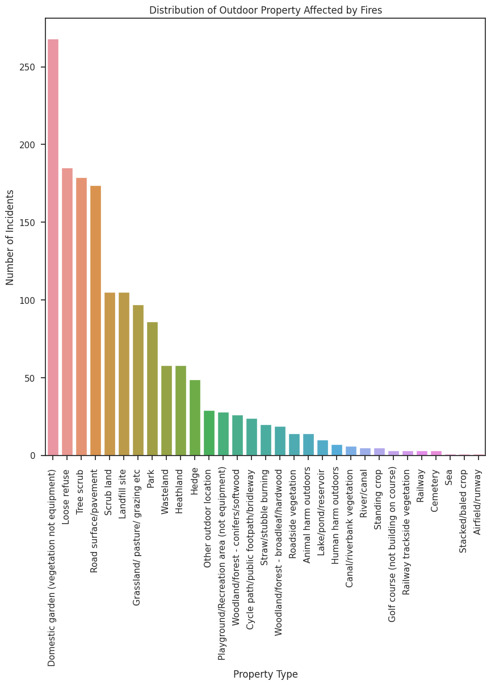

- Rate of Fire incident by Month
  We plotted the months and calculated the number of incidents for each month to find out the highest rate of incident. From the fig we can see July has the most occurrence of Fire incident.
  
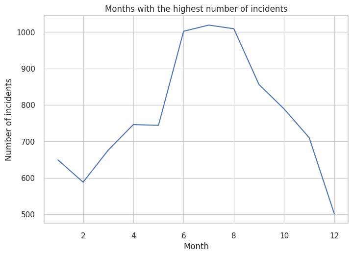

- Occurrence Of Fire Incident by Time
  From the bar plot below, we can see that at 6:00 p.m., most fire incidents occurs.
  
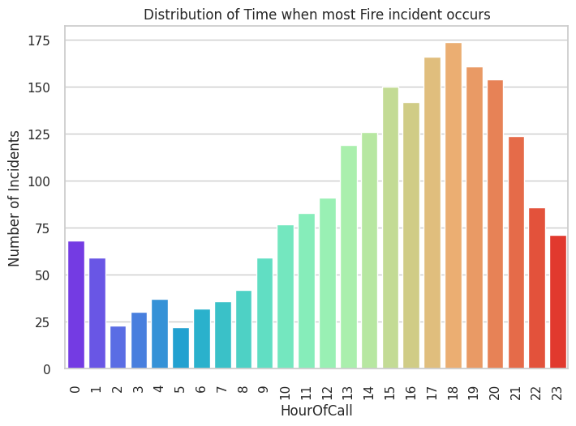

- Cost Analysis : Average National Cost
We can see from the plot below that the highest average national cost is Fire approximately £759.32 and the second is Special Service. False Alarm has the lowest average cost.

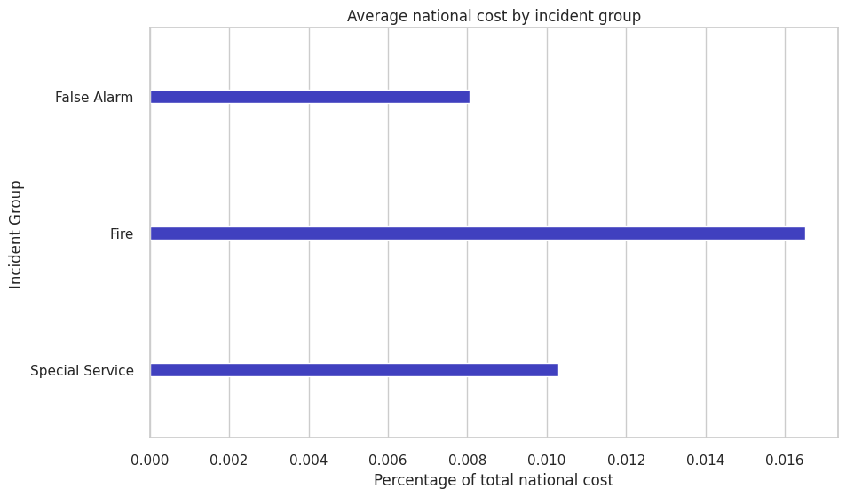

- Top 5 Property Categories by Percentage of Total National Cost
  The bar plot below demonstrates the top 5 property categories with their percentages of total national cost. We can see that Dwelling category has highest percentage of national cost which is almost 45%. Non-Residential has the second position in terms of total national cost which is almost over 20%. Other Residential property has the over 5% total national cost which is the lowest.
  
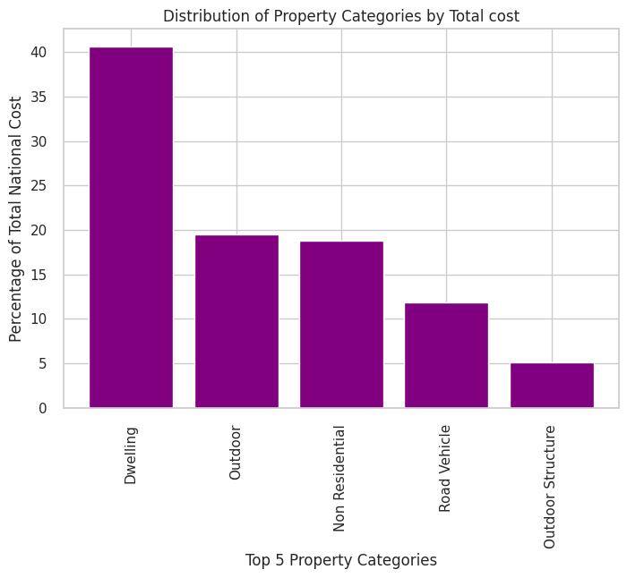

- Property Category with most Pump Count
  The figure below shows the percentages of total number of times water was pumped at the incident. We can the Dwelling category has the highest number of pump count.

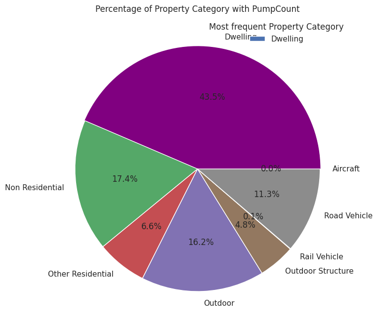

- Call Time Analysis: Based on the image below, we can see that fire incidents have slightly longer call duration compared to false alarm and special service incidents. The call durations for false alarm and special service incidents are relatively similar to each other.
- 
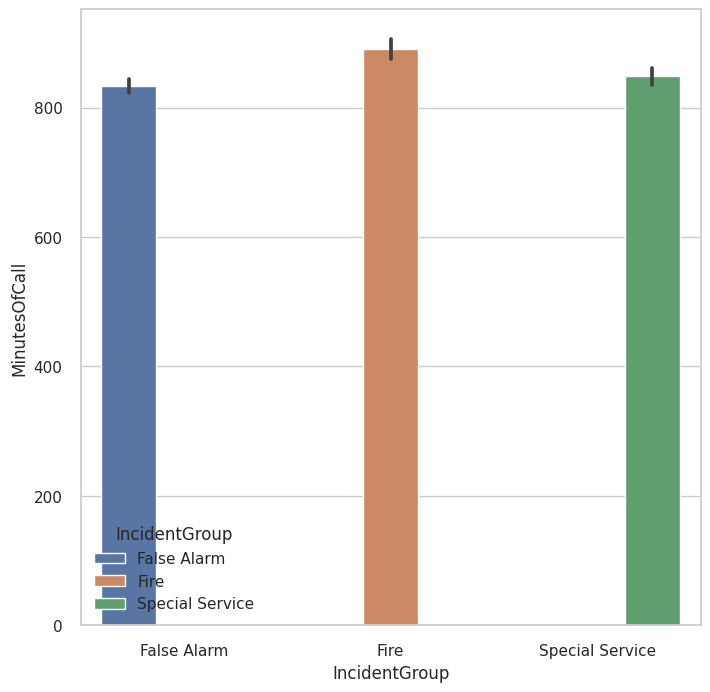

